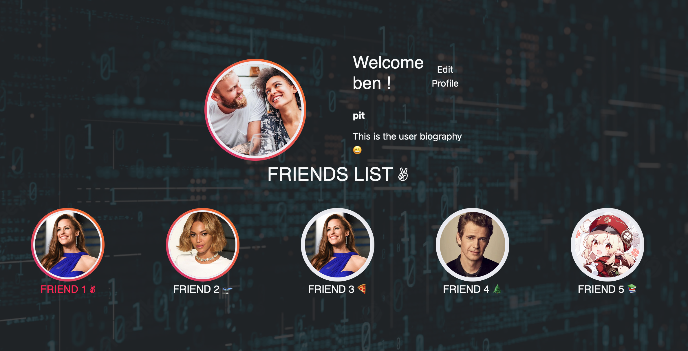
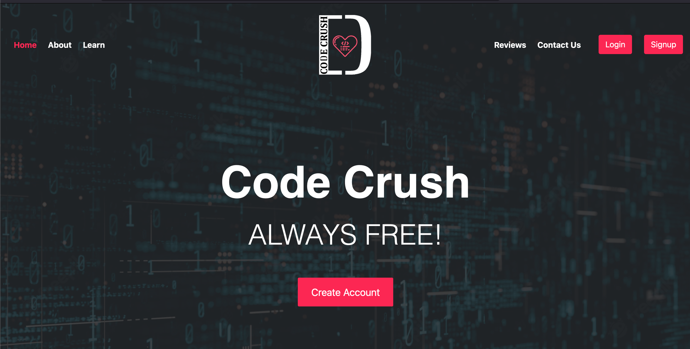
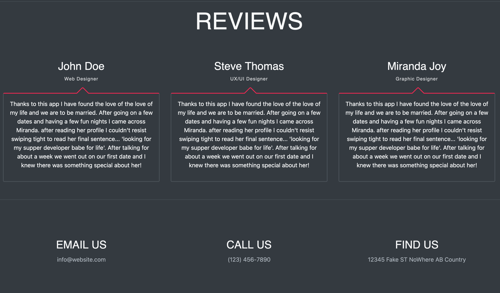

# Code Crush

   [](https://opensource.org/licenses/MIT)

  ## Description
  Code Crush is a dating app for coders, by coders. Connect with like-minded individuals to develop relationships and merge your branches. When matched, you are able to clone eachother's github repos and continue on your way to becoming a coding couple! 

  This app demonstrates a React front end on top of a Node.js and Express.js server. MongoDB is utilized for the database, and Mongoose for DB management in Node. 

  ## [Click here for the Heroku deployed live demo](https://mycodecrush.herokuapp.com/)

  * * * * * *


  ## Table of Contents
  1. [Description](#Description)
  2. [Installation](#Installation)
  3. [Usage](#Usage)
  4. [Credits](#credits)
  5. [Questions](#questions)
  6. [License](#License)

  * * * * * *

  <a name="Installation"></a>
  ## Installation
  Clone repo, run 'npm i', then 'npm run develop' for a fast setup. Run 'npm run build' to create a packaged app.

  <a name="Usage"></a>
  ## Usage
  Once installed, this app can be accessed by default at localhost:3000 in your browser.

  *****

  

  *****

  

  *****

  
  
  <a name="Credits"></a>
  ## Credits
  
 * [Furhan Samani](https://github.com/furhan-dev)
 * [Sheryl H ](https://github.com/reversedentistry)
 * [Kelton Leach](https://github.com/Keltonlea)
 * [Hossein Neiman](https://github.com/neiman924)
 * [Ben Pitroff](https://github.com/chicken1991)

  <a name="questions"></a>
  ## Questions
  For any questions, contact any of the contributors in the [Credits section above](#credits)

  <a name="License"></a>
  ## License


```md
COPYRIGHT 2022 Flex Full-Stack Project 3, Group 3
Permission is hereby granted, free of charge, to any person obtaining a copy of this software and associated documentation files (the "Software"), to deal in the Software without restriction, including without limitation the rights to use, copy, modify, merge, publish, distribute, sublicense, and/or sell copies of the Software, and to permit persons to whom the Software is furnished to do so, subject to the following conditions:

The above copyright notice and this permission notice shall be included in all copies or substantial portions of the Software.

THE SOFTWARE IS PROVIDED "AS IS", WITHOUT WARRANTY OF ANY KIND, EXPRESS OR IMPLIED, INCLUDING BUT NOT LIMITED TO THE WARRANTIES OF MERCHANTABILITY, FITNESS FOR A PARTICULAR PURPOSE AND NONINFRINGEMENT. IN NO EVENT SHALL THE AUTHORS OR COPYRIGHT HOLDERS BE LIABLE FOR ANY CLAIM, DAMAGES OR OTHER LIABILITY, WHETHER IN AN ACTION OF CONTRACT, TORT OR OTHERWISE, ARISING FROM, OUT OF OR IN CONNECTION WITH THE SOFTWARE OR THE USE OR OTHER DEALINGS IN THE SOFTWARE.
```        


[License: MIT](https://opensource.org/licenses/MIT)
